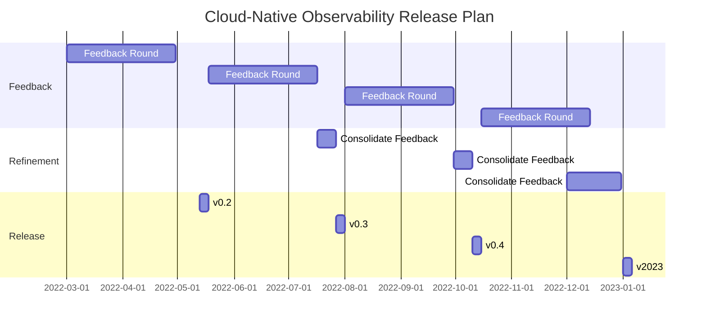

# How to Contribute

The purpose of this repository is to build, in public, an opinionated editorial
stance on the topic of cloud-native observability. To this end, we encourage
contributions from interested community members from across the cloud-native and
observability landscapes.

This becomes a better resource with your help and time! We gladly accept Pull
Requests and Issues from everyone -- small, noncontroversial PR's (spelling,
grammar, etc.) should be accepted quickly. If you'd like to make a larger PR
that edits, removes, adds, or expands upon a section or significant portion of
the text then we'd appreciate if you opened an issue to discuss it first.

If you'd like to discuss a more substantial change, or have feedback that
doesn't fit neatly into a scoped issue, then opening a thread in our [discussion
forum](https://github.com/lightstep/cloud-native-observability/discussions) is a
great way to start the conversation.

## Development Dependencies and Setup

* Node.JS

This repository enforces an 80-100 character column width to aid in PR reviews.
To assist with this, a GitHub action runs for each PR to ensure adherence.
When making changes, it's suggested that you work off of a local copy of the
repository and ensure these checks pass locally.

To set up the checks, please consult the following instructions:

1. Run `npm install` from the root directory of the repository to install
   necessary tools.
2. Before making a PR, ensure `npm run lint` and `npm run spellcheck` both
   clear.

## Release Cadence

This chart is intended to give a rough release cadence for iterations for the
rest of the year.

## Release Process

Please ensure that `npm run pdf` has been executed and the pdf committed before
release.
